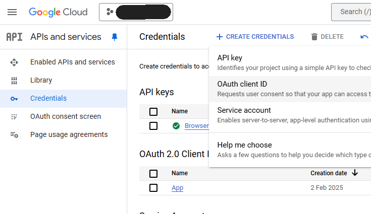
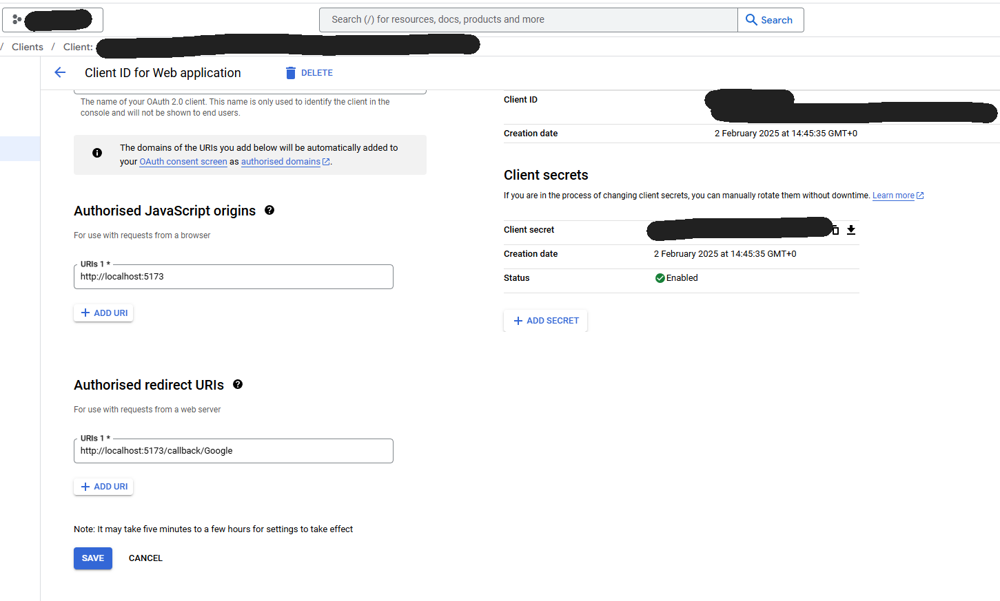

# OAuth package

This package simplifies OAuth when it comes to initialization and talking with the IDPs.

It's implemented with Google and Microsoft, and will require credentials with at least Google to work.

## Setup Google

### 1. Create credentials

First, go to [the console](https://console.cloud.google.com/) and search for "APIs and services".

When you are on the APIs and services page, click on "Credentials", then on the top banner, "Create credentials" > "OAuth client ID".

In the application type, select "Web application", and name your application.

In the Authorized JavaScript origins, you will add two urls:

- `http://localhost:portOfYourFrontend` for dev
- `https://yourdomain.com` for production

In the Authorised redirect URIs, in a similar fashion, add:

- `http://localhost:portOfYourFrontend/auth/callback/google` for dev
- `https://yourdomain.com/auth/callback/google` for production

Then hit "save", and your credentials will appear. Don't worry you can see those credentials at any time by going back to your app in the "Credentials screen".

Finally, copy and paste the client ID and client secret into your secrets or environment variables, under the key `GOOGLE_CLIENT_ID` and `GOOGLE_CLIENT_SECRET`.

> _If you wish, you can create two apps, one for dev and one for production, to avoid sharing the ID and secrets. Simply repeat the steps_

### 2. Add scopes

Now go to "Data access", to add the scopes your app will request, then click on "Add or remove scopes".

You will need to search and select:

- openid
- /auth/userinfo.email
- /auth/userinfo.profile

And finally click on "Add or update".

### 3. Create your consent screen

Go to branding, and fill the form.

That's it, you are good to go.

## Setup Microsoft

### 1. Get your credentials

Head to [The portal](https://portal.azure.com/), go to Entra and select "create new application", name your app and click "register".

On the next screen, select "Authentication" on the side bar. If this is not already here, add the "Web" platform.

In the redirect urls, set:

- `http://localhost:portOfYourFrontend` for dev
- `https://yourdomain.com` for production

Scroll down, and select "ID token" in the implicit and hybrid flow section.

### 2. Get your secrets

Now head to Certificates and secrets > Client secrets > New client secret.

- Create a secret called 'dev', and select the duration you want.
- Then create a secret called 'prod', and select the duration you want.
- Copy and paste the secret into your secrets or environment variables, under the keys `MICROSOFT_CLIENT_ID` and `MICROSOFT_CLIENT_SECRET`.

### 3. Set your branding

You will also need to create an MPN account and verify your domain to be able to use OAuth.
